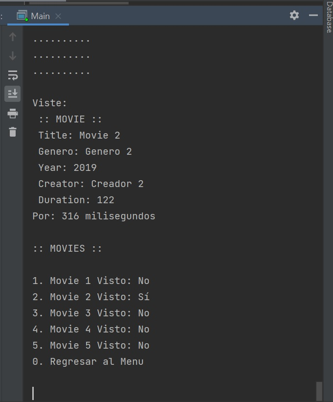
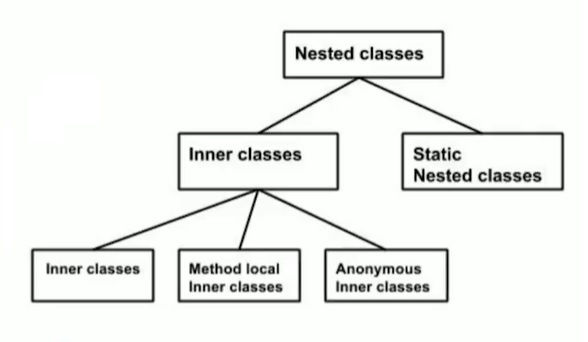
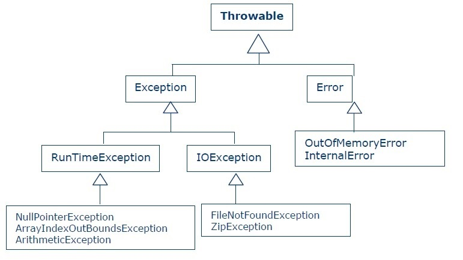
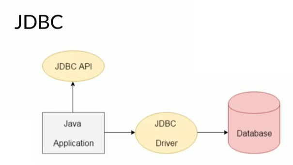
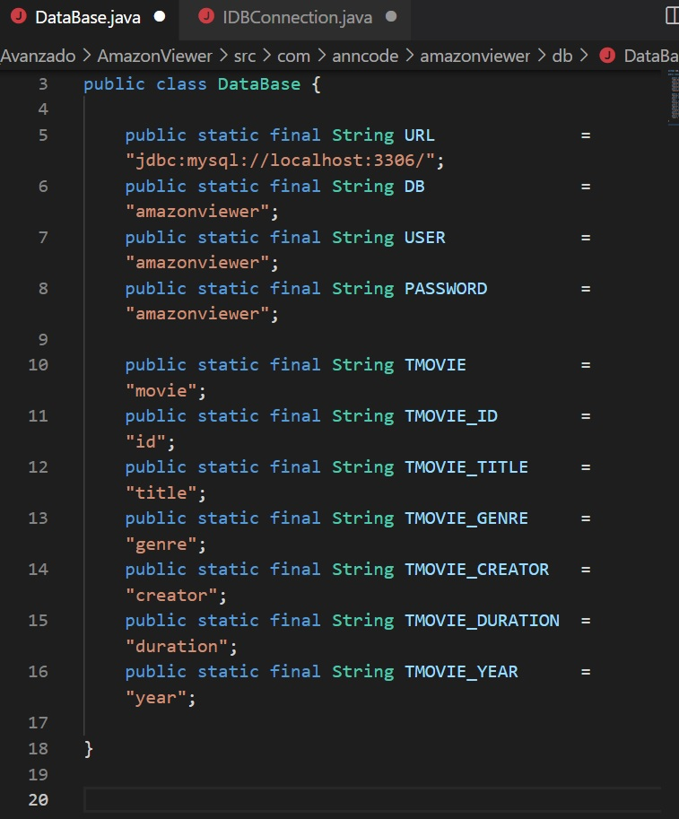
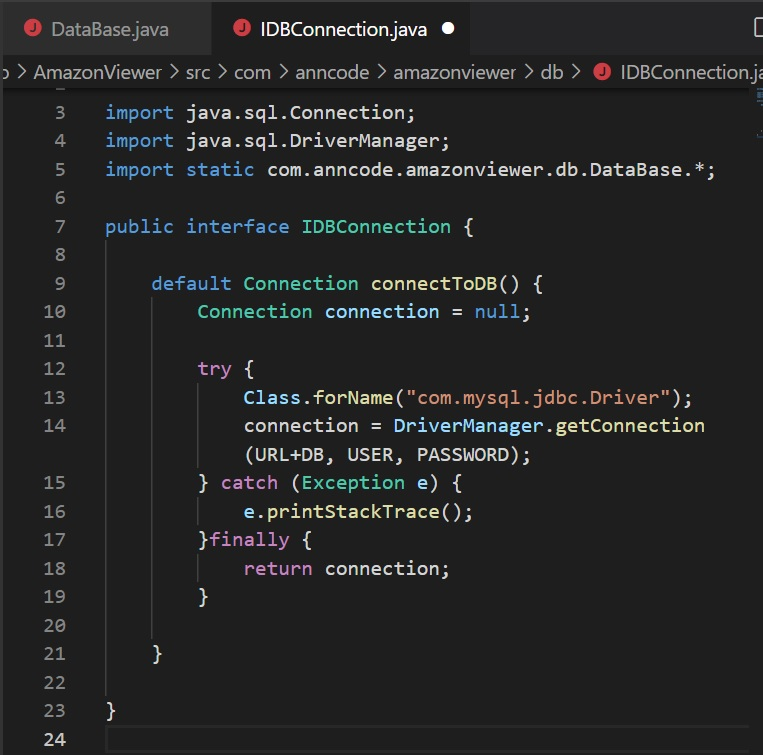
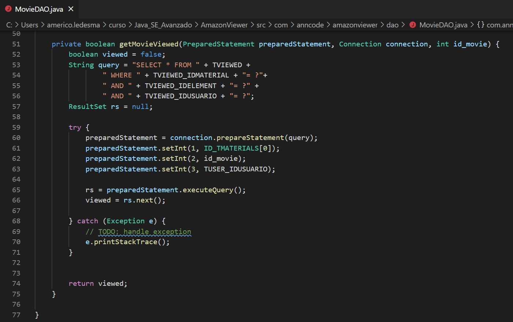

# Java Advanced Course

##### Table of contents
* [Introduction](#introduction) 
* [Technologies](#technologies)
* [Syntax](#syntax)
* [Illustrations](#illustrations)

## Introduction
In this course we learn and practice about Abstract classes, Abstract Methods, JavaDocs tags, Functional Interfaces, Lambdas, how to create a conection with the database and much more.

## Technologies
* Java 9

## Syntax
##### Java Nested and Inner Class
```java
class OuterClass {
    // ...
    class NestedClass {
        // ...
    }
}
```

##### Nested Classes - Inner
```
public class Outer {
    // ...
    public class Inner {
        // ...
    }
}
Outer outer = new Outer();
Outer.Inner inner = outer.new Inner();
```

##### Method-local classes
```
class Test {
    void f() {
        // Method local inner class
        class InnerClass {
            private String myThreadName;
            // InnerClass constructor
            public InnerClass(String myThreadName) {
                this.myThreadName = myThreadName;
            }
            // InnerClass method
            public void run() {  
                Thread thread = new Thread(
                    // Anonymous inner class inside method local inner class
                    new Runnable() {
                        public void run() {
                            doSomethingBackgroundish();
                        }
                    }
                );
                thread.setName(myThreadName);
                thread.start();
            }
        }
        InnerClass anInnerClass = new InnerClass(aThreadName);
        anInnerClass.run();
    }
}
```

##### JDBC API Practice
```
PreparedStatement pstGuitarras;

Connection cn = DriverManager.getConnection("jdbc:mysql://localhost:3304/catalogo”, "root", "");

pstGuitarras = cn.preparedStatement(“Select * from guitarra, usuario where guitarra.tipo = premium AND usuario.tipo = premium”);

ResultSet rs = pstGuitarras.executeQuery();

rs.close();
cn.close();
```

##### try-catch-finally 
```
try {
    // try_statements
} 
catch(ExceptionType name) {
    // body of catch  
}
catch(ExceptionType name) {
    // body of catch  
}
finally() {
    // codes that gets executed anyway
}
```

##### try-with-resource Example
```
import java.io.FileNotFoundException;  
import java.io.FileOutputStream;  
public class FinalVariable {  
    public static void main(String[] args) throws FileNotFoundException {  
        FileOutputStream fileStream=new FileOutputStream("javatpoint.txt");  
        try(fileStream){  
             String greeting = "Welcome to javaTpoint.";      
                byte b[] = greeting.getBytes();       
                fileStream.write(b);      
                System.out.println("File written");           
        }catch(Exception e) {  
            System.out.println(e);  
        }         
    }  
}  
```

##### Map declaration
```
Map<Integer, String> map = new HashMap<Integer, String>();
Map<Integer, String> treeMap = new TreeMap<Integer, String>();
Map<Integer, String> linkedHashMap = new LinkedHashMap<Integer, String>();
```

##### Functional Interface example
```
public interface MyFunctionalInterface {
  public void myMethod();
  public default void printText(String text) {
    System.out.println(text);
  }
  public static void printText(String text, PrintWriter writer) throws IOException {
    writer.write(text);
  }
}
```


## Illustrations

##### Abstract methods implementation

*********************************************
##### Nested classes diagram

*********************************************
##### Throwable Diagram

*********************************************
##### JDBC 
##### Java Data Base Connectivity

*********************************************
##### Database and IDBConnection 


*********************************************
##### SELECT Sentence with parameters
First we need prepare the query, then give the parameters respectively,
finally execute the query and storage the result

*********************************************
